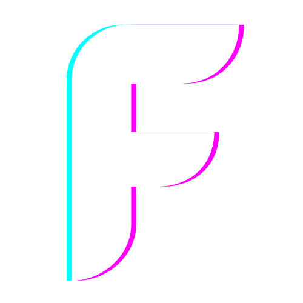

# [SoulExtract.com](https://soulextract.com)

Alternative Rock injected with electronic and cinematic elements.
Proud member of the [FiXT](https://www.fixtonline.com) roster.

Check the music out at **[Spotify](https://open.spotify.com/artist/1cEPAqNFhmARDe0HgKOD3h)**.

The website was powered by the **[Arwes](https://arwes.dev)** project.

## Contributors

<!-- ALL-CONTRIBUTORS-LIST:START - Do not remove or modify this section -->
<!-- prettier-ignore-start -->
<!-- markdownlint-disable -->
<table>
  <tr>
    <td align="center"><a href="https://RomelPerez.com"> <b>Romel Pérez</b></a> <a href="#projectManagement-romelperez" title="Project Management">📆</a> <a href="https://github.com/firmanjabar/firmanjabar.my.id/commits?author=romelperez" title="Code">💻</a> <a href="https://github.com/firmanjabar/firmanjabar.my.id/commits?author=romelperez" title="Tests">⚠️</a></td>
    <td align="center"><a href="https://github.com/mario211226"> <b>mario211226</b></a> <a href="#design-mario211226" title="Design">🎨</a> <a href="#ideas-mario211226" title="Ideas, Planning, & Feedback">🤔</a></td>
    <td align="center"><a href="https://github.com/firmanjabar"> <b>Firman Abdul Jabar</b></a> <a href="#blog-firmanjabar" title="Blogposts">📝</a> <a href="#content-firmanjabar" title="Content">🖋</a> <a href="https://github.com/firmanjabar/firmanjabar.my.id/commits?author=firmanjabar" title="Code">💻</a></td>
  </tr>
</table>

<!-- markdownlint-enable -->
<!-- prettier-ignore-end -->
<!-- ALL-CONTRIBUTORS-LIST:END -->

This project follows the [all-contributors](https://github.com/kentcdodds/all-contributors)
specification.
